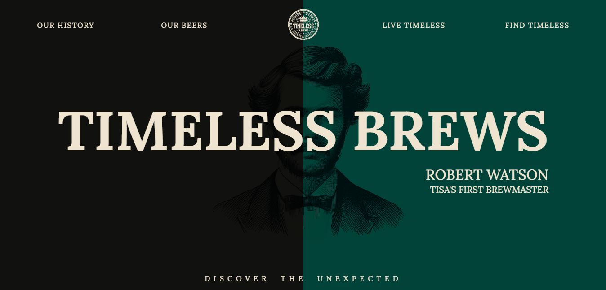
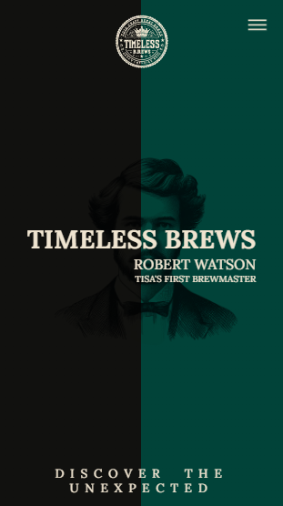

# Timeless Brews Landing Page

Welcome to the repository for the "Timeless Brews" landing page! 🍺

This project was developed as a personal initiative to showcase my skills in web development and user experience design. The landing page features a fictional beer called "Timeless Brews," blending tradition with a modern twist.

## Technologies Used

- React: I utilized React for the development of the page, harnessing its power and flexibility.
- Design Inspired by Dribbble: The page's design is based on an incredible creation I found on Dribbble. You can find the design [here](https://dribbble.com/shots/5657029-sapporo-beer?utm_source=Clipboard_Shot&utm_campaign=emrescr&utm_content=sapporo%20beer&utm_medium=Social_Share&utm_source=Clipboard_Shot&utm_campaign=emrescr&utm_content=sapporo%20beer&utm_medium=Social_Share).

## Screenshots

| Desktop                                           | Mobile                                          |
| ------------------------------------------------- | ----------------------------------------------- |
|  |  |

## How to Test the Page

1. Clone this repository to your local machine.
2. Open a terminal in the project's root folder.
3. Run `npm install` to install the dependencies.
4. Run `npm run dev` to launch the application in development mode.

## Contributions

I appreciate contributions and feedback! If you have suggestions or improvements, feel free to open an issue or submit a pull request.

## Link to the Page

You can view the page in action [here](https://timeless-brews.vercel.app/).

## Contact

If you wish to get in touch with me, you can find me on [LinkedIn](https://www.linkedin.com/in/lemartinezm/).

Thank you for visiting this repository and for your interest in my work! 😊
